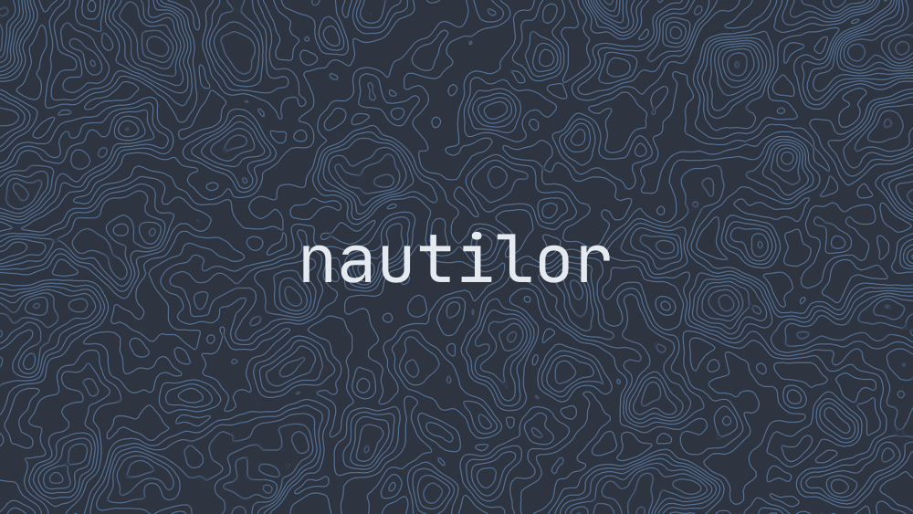

# Profile

👋  Hello There



```js
const profile = {
    firstName: 'Edoardo',
    lastName: 'Zerbo',
    telegram: 'https://t.me/WMD_Edoardo',
    linkedin: 'https://www.linkedin.com/in/edoardo-zerbo-551b93190/',
    prefered_os: 'Linux',
    languages: ['Python', 'Java', 'JS', 'Bash', 'TS', "C#"],
    frameworks: ['React', 'SpringBoot'],
    container: ['Docker', 'Kubernetes'],
    databases: ['MongoDB', 'MySQWL', 'PostgreSQL'],
    editors: ['nvim', 'VSCode', 'IntelliJ'],
    fullstack: true,
    learning: ['Rust'],
}
```


<p align="center">
	
</p>


## Expertise


